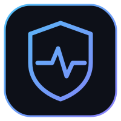
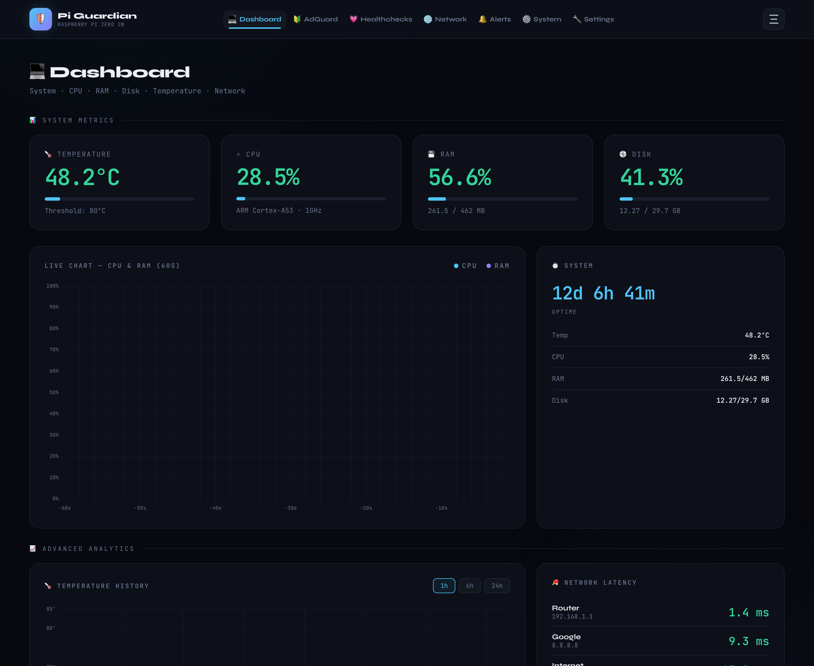
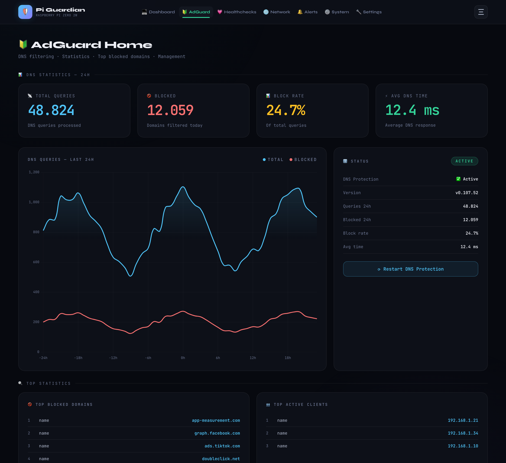
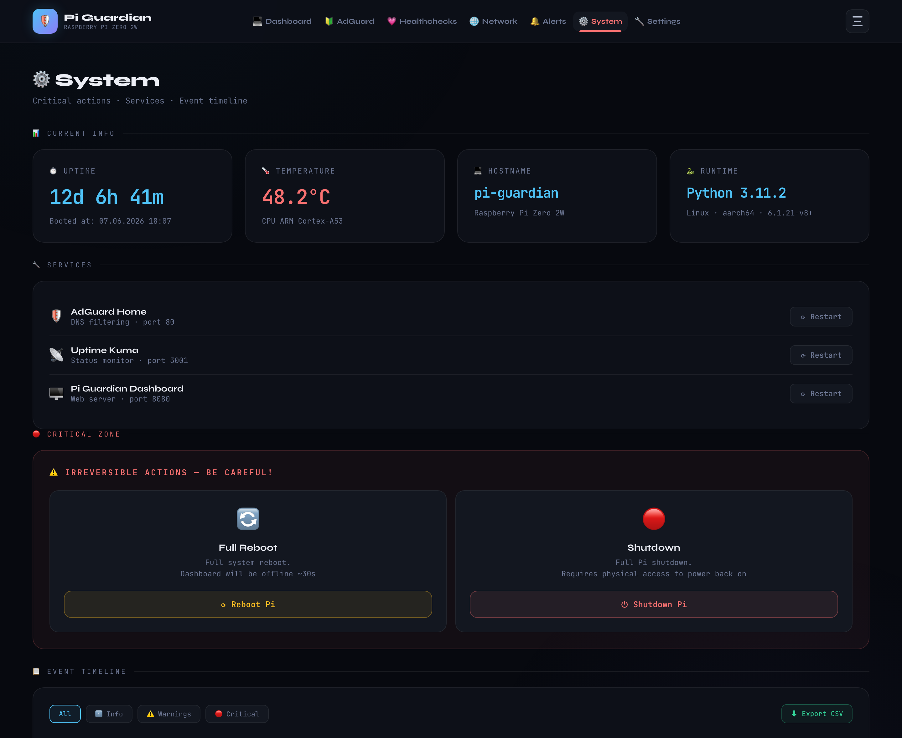
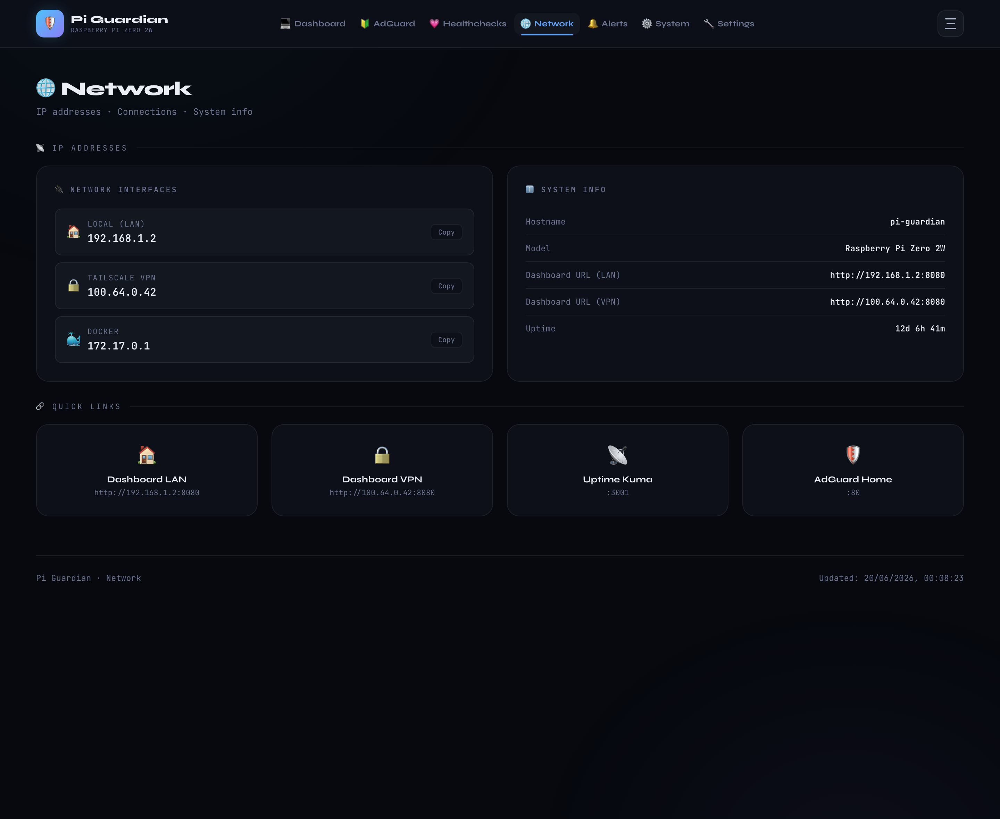
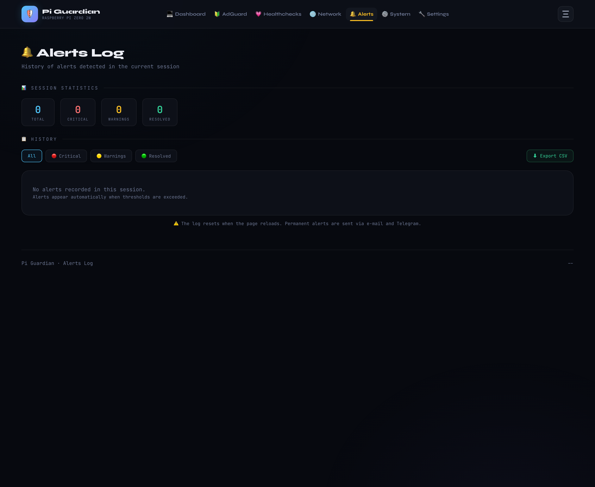
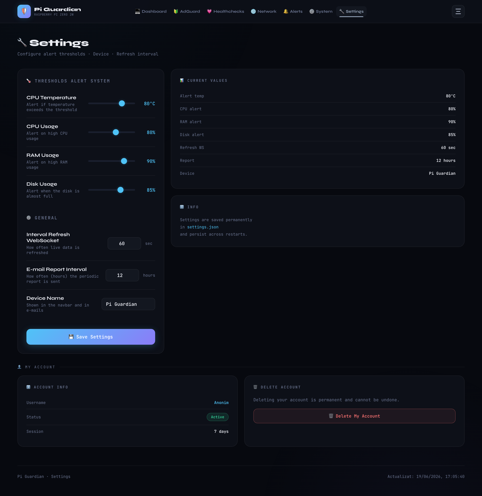
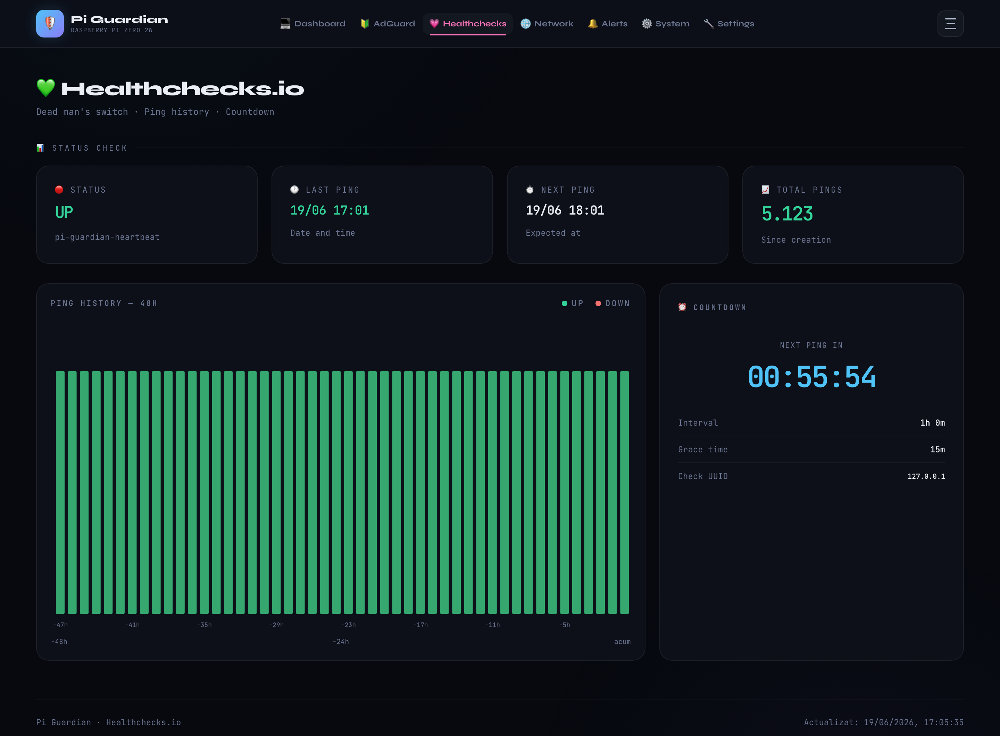
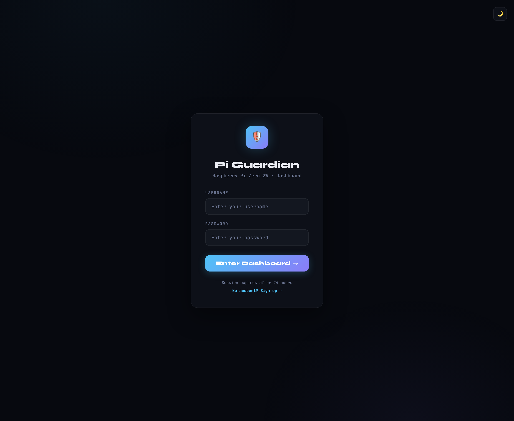

<div align="center">



# Pi Guardian

### A premium, self-hosted monitoring dashboard for your Raspberry Pi.

Live system metrics over WebSocket, AdGuard Home & Pi-hole insight, network
latency, alerts, remote actions and automated reports — in a fast, calm,
dark-mode interface that runs comfortably on a **Raspberry Pi Zero 2 W**.

<br/>

[](https://github.com/VIK-DD/raspberry-pi-monitor/actions/workflows/ci.yml)
[](https://github.com/VIK-DD/raspberry-pi-monitor/releases/latest)
[](LICENSE)
[](https://www.python.org/)
[](https://fastapi.tiangolo.com/)
[](https://www.uvicorn.org/)
[](https://www.sqlite.org/)

[](#-rest--websocket-api)
[](#-features)
[](#-deploy-on-a-raspberry-pi)
[](#-demo-mode)
[](#-deploy-on-a-raspberry-pi)
[](https://github.com/VIK-DD/raspberry-pi-monitor/stargazers)

<br/>



</div>

---

> [!NOTE]
> **Try it in 30 seconds — no Raspberry Pi required.** Pi Guardian ships with a
> built-in **[demo mode](#-demo-mode)** that serves realistic synthetic data, so
> you can explore the full dashboard on any machine. All screenshots below were
> generated in demo mode.

## 📑 Table of contents

- [Features](#-features)
- [Screenshots](#-screenshots)
- [Tech stack](#-tech-stack)
- [Quick start (local)](#-quick-start-local)
- [Demo mode](#-demo-mode)
- [Configuration](#-configuration)
- [Deploy on a Raspberry Pi](#-deploy-on-a-raspberry-pi)
- [REST & WebSocket API](#-rest--websocket-api)
- [Project structure](#-project-structure)
- [Security notes](#-security-notes)
- [Roadmap](#-roadmap)
- [Contributing](#-contributing)
- [License](#-license)

---

## ✨ Features

#### 📊 Live monitoring
- **Real-time dashboard** — CPU, temperature, RAM, disk and uptime, pushed over
  a **WebSocket** every few seconds (no polling, no page reloads).
- **Advanced analytics** — temperature history, network latency (ping) charts,
  live bandwidth and disk I/O for the SD card.

#### 🛡 Network & DNS
- **AdGuard Home / Pi-hole** — total queries, block rate, average response time,
  top blocked domains and top clients, with a one-click DNS-protection restart.
- **Network page** — local / Tailscale / Docker IP addresses and interfaces,
  copy-to-clipboard, and reachability pings to router, Google and Cloudflare.

#### 🔔 Alerts & reports
- **Configurable thresholds** for temperature, CPU, RAM and disk, with a live
  in-session alert log.
- **Automated notifications** via **e-mail**, **Telegram**, **Healthchecks.io**
  and **Uptime Kuma** (`monitor.py`, run from cron).
- **Monthly PDF reports** generated with ReportLab (`monthly_report.py`).

#### 🔐 Access & control
- **Authentication** with salted **PBKDF2** password hashing and HTTP-only
  session cookies, plus a registration flow with **e-mail admin approval**.
- **Remote actions** — reboot, shutdown, and restart services (dashboard,
  AdGuard, Uptime Kuma) straight from the UI, with per-action rate limiting.
- **Security headers** and gzip compression out of the box.

#### 🎨 Interface
- Clean **dark theme**, responsive layout, keyboard-friendly, and a slide-out
  navigation panel — all vanilla HTML/CSS/JS, **no build step**.

## 📸 Screenshots

| Dashboard | AdGuard Home |
|---|---|
|  |  |

| System | Network |
|---|---|
|  |  |

| Alerts | Settings |
|---|---|
|  |  |

| Healthchecks | Login |
|---|---|
|  |  |

## 🧰 Tech stack

| Layer | Technology |
|---|---|
| **Backend** | Python 3.9+, [FastAPI](https://fastapi.tiangolo.com/), [Uvicorn](https://www.uvicorn.org/) |
| **Realtime** | WebSocket (live stats broadcast) |
| **System metrics** | [psutil](https://github.com/giampaolo/psutil), `vcgencmd`, `/proc`, `/sys` |
| **Storage** | SQLite (single file, no server) |
| **Reports** | [ReportLab](https://www.reportlab.com/) (PDF) |
| **Frontend** | Vanilla HTML / CSS / JavaScript — no framework, no build |
| **Integrations** | AdGuard Home, Pi-hole, Healthchecks.io, Uptime Kuma, Telegram, Gmail |

## 🚀 Quick start (local)

```bash
# 1. Clone
git clone https://github.com/VIK-DD/raspberry-pi-monitor.git
cd raspberry-pi-monitor

# 2. Create a virtual environment and install dependencies
python3 -m venv venv
source venv/bin/activate          # Windows: venv\Scripts\activate
pip install -r requirements.txt

# 3. Configure
cp .env.example .env              # then edit .env

# 4. Run the dashboard
cd dashboard
uvicorn main:app --host 0.0.0.0 --port 8080
```

Open <http://localhost:8080>. Sign in with the `DASHBOARD_USER` /
`DASHBOARD_PASS` you set in `.env`.

## 🧪 Demo mode

Want to look around without a Raspberry Pi, AdGuard, or any external service?
Enable demo mode and every panel is filled with realistic synthetic data:

```bash
cp .env.example .env
echo "DEMO_MODE=1" >> .env
cd dashboard && uvicorn main:app --port 8080
```

In demo mode the dashboard is **open** (authentication is bypassed) and remote
actions (reboot, shutdown, restarts) are **no-ops**, so it is completely safe to
run anywhere. Turn it off (`DEMO_MODE=0`) for real use.

## ⚙️ Configuration

All configuration lives in `.env` (copy it from `.env.example`). The most useful
options:

| Variable | Default | Description |
|---|---|---|
| `DASHBOARD_PORT` | `8080` | Port the dashboard listens on |
| `REFRESH_INTERVAL` | `5` | Live-stats push interval (seconds) |
| `DEVICE_NAME` | `Pi Guardian` | Name shown in the UI and e-mails |
| `DEMO_MODE` | `0` | `1` = serve synthetic data, bypass auth |
| `DASHBOARD_USER` / `DASHBOARD_PASS` | `admin` / — | Built-in admin account |
| `SESSION_SECRET` | — | Random string for session signing |
| `AGH_HOST` / `AGH_USER` / `AGH_PASS` | — | AdGuard Home connection |
| `ALERT_CPU_TEMP` / `ALERT_CPU_USAGE` | `75` / `90` | Alert thresholds (°C / %) |
| `ALERT_RAM_USAGE` / `ALERT_DISK_USAGE` | `90` / `85` | Alert thresholds (%) |
| `GMAIL_USER` / `GMAIL_APP_PASS` | — | Gmail for approval e-mails (optional) |
| `TG_BOT_TOKEN` / `TG_CHAT_ID` | — | Telegram alerts (optional) |
| `HC_API_KEY` / `HC_UUID` / `HC_PING_URL` | — | Healthchecks.io (optional) |
| `UPTIME_KUMA_PUSH_URL` | — | Uptime Kuma push monitor (optional) |

Alert thresholds, device name, weather city and refresh interval can also be
changed live from the **Settings** page; they are persisted to `settings.json`.

## 🍓 Deploy on a Raspberry Pi

On the Pi, clone the repo and install dependencies as above, then run the
dashboard as a **systemd** service so it survives reboots:

```ini
# /etc/systemd/system/pi-guardian.service
[Unit]
Description=Pi Guardian dashboard
After=network-online.target

[Service]
User=pi
WorkingDirectory=/home/pi/raspberry-pi-monitor/dashboard
ExecStart=/home/pi/raspberry-pi-monitor/venv/bin/uvicorn main:app --host 0.0.0.0 --port 8080
Restart=always

[Install]
WantedBy=multi-user.target
```

```bash
sudo systemctl enable --now pi-guardian
```

Schedule alerts and the monthly PDF report from cron:

```cron
# Check thresholds every 15 minutes and notify on problems
*/15 * * * * cd /home/pi/raspberry-pi-monitor && venv/bin/python monitor.py alert
# Generate & e-mail the monthly report on the 1st at 08:00
0 8 1 * *   cd /home/pi/raspberry-pi-monitor && venv/bin/python monthly_report.py
```

> Remote **reboot/shutdown** actions require the dashboard user to have the
> relevant `sudo` rights (e.g. a sudoers rule for `/sbin/reboot`).

## 🔌 REST & WebSocket API

Pi Guardian exposes a small JSON API (all under `/api`, session-protected unless
in demo mode). Highlights:

| Method | Endpoint | Description |
|---|---|---|
| `GET` | `/api/stats` | Current system + AdGuard snapshot |
| `GET` | `/api/system/info` | Uptime, boot time, hostname |
| `GET` | `/api/temp-history` | CPU temperature history |
| `GET` | `/api/ping` | Latency to router / Google / Cloudflare |
| `GET` | `/api/bandwidth` · `/api/disk-io` | Live network & disk throughput |
| `GET` | `/api/adguard/history` | AdGuard query/block history |
| `GET` | `/api/healthchecks` | Healthchecks.io status |
| `GET` | `/api/network` | Local / Tailscale / Docker IPs |
| `POST` | `/api/actions/{reboot,shutdown,...}` | Remote system actions |
| `WS` | `/ws` | Live stats stream |

Interactive docs are available at `/docs` (FastAPI / OpenAPI).

## 🗂 Project structure

```
raspberry-pi-monitor/
├── collector.py          # Shared system + AdGuard data collection
├── monitor.py            # Cron: periodic reports & alerts (e-mail/Telegram/HC)
├── monthly_report.py     # Monthly PDF report generator (ReportLab)
├── demo_data.py          # Synthetic data provider for DEMO_MODE
├── dashboard/
│   ├── main.py           # FastAPI app: routes, auth, WebSocket, REST API
│   └── static/           # HTML pages, base.css, nav.js (no build step)
├── settings.json         # Live-editable runtime settings
├── requirements.txt
├── .env.example
└── docs/
    ├── assets/logo.svg
    └── screenshots/
```

## 🔒 Security notes

- Passwords are stored as salted **PBKDF2-SHA256** hashes; sessions use
  HTTP-only cookies.
- **Never commit your `.env`**, TLS certificates, databases or logs — they are
  already covered by `.gitignore`.
- Sessions are kept in memory, so all users are logged out on restart. For a
  hardened multi-user deployment, put the dashboard behind a reverse proxy with
  TLS (or expose it only over **Tailscale**/VPN).
- `DEMO_MODE` disables authentication on purpose — only use it for demos.

## 🗺 Roadmap

- [ ] Persistent sessions (survive restarts)
- [ ] Optional Pi-hole-native API (in addition to AdGuard Home)
- [ ] Configurable ping targets from the UI
- [ ] Historical metrics stored in SQLite + range charts
- [ ] Docker image & `docker-compose`

## 🤝 Contributing

Issues and PRs are welcome! For substantial changes, open an issue first to
discuss what you'd like to change. Run `pytest` before submitting — see
[CONTRIBUTING.md](CONTRIBUTING.md) for the full guide.

---

<h2 align="center">📄 License</h2>

<p align="center">
  Licensed under the <strong>Apache License 2.0</strong> — see <a href="LICENSE"><strong>LICENSE</strong></a> for details.<br/>
  <strong>Copyright © 2026 VIK-DD</strong>
</p>

<p align="center">
  <strong>Made to be calm, fast, and yours</strong> · Made in Moldova 🇲🇩
</p>
